# ggnomics

> Grammar-of-graphics single-cell and multi-omics plotting for Python.
> Built on [plotnine](https://plotnine.org) (≥ 0.15).

`ggnomics` provides publication-quality plots for single-cell and multi-omics data.
It wraps plotnine so every function returns a `ggplot` object — or a native
plotnine `Compose` for multi-panel layouts — which means all standard plotnine
theming, faceting, and composition operators work without any extra glue code.
Input can be `anndata.AnnData`, `SingleCellExperiment`, `SummarizedExperiment`,
or a plain `pd.DataFrame`. It does **not** perform analysis; it only visualises.

## Installation

### Stable
```bash
pip install ggnomics
```

### With optional dependencies
```bash
pip install "ggnomics[stats]"      # statistical annotations (scipy, statsmodels)
pip install "ggnomics[multimodal]" # CITEseq / MuData support
pip install "ggnomics[sce]"        # SingleCellExperiment / BiocPy support
pip install "ggnomics[all]"        # everything
```

### Development (plotnine 0.16 alpha for `plot_layout` support)
```bash
pip install "git+https://github.com/has2k1/plotnine.git"
pip install -e ".[all]"
```

## Supported input types

| Input type | Embeddings | Expression | obs metadata | var metadata |
|---|---|---|---|---|
| `pd.DataFrame` | columns | columns | columns | — |
| `anndata.AnnData` | `obsm` | `X` / layers | `obs` | `var` |
| `SingleCellExperiment` | `reducedDims` | assays | `colData` | `rowData` |
| `SummarizedExperiment` | — | assays | `colData` | `rowData` |

`SummarizedExperiment` supports all plots except dimensionality-reduction plots
(no embeddings stored).

---

## Plot gallery

```python
import ggnomics as gg
# adata: AnnData with obsm["X_umap"], obs["cluster","batch","sample"], and gene X
```

---

### Dimensionality reduction

`plot_umap`, `plot_pca`, `plot_tsne`, `plot_reduced_dim` — all return `ggplot`.

- Color by any `obs` column (categorical → discrete palette, numeric → viridis).
- Color by gene name (expression fetched from `X` or a named layer).
- `facet_by` for batch comparison in a single call.
- `order=` draws listed categories on top (Seurat-style z-ordering).
- Point size and stroke scale adaptively with `n_cells` (more cells → smaller points).

```python
# Cluster UMAP
plot_umap(adata, color="cluster")

# Continuous gene expression
plot_umap(adata, color="CD3E")

# Faceted by batch
plot_umap(adata, color="cluster", facet_by="batch")

# Custom PCA components
plot_pca(adata, color="cluster", components=(1, 3))
```

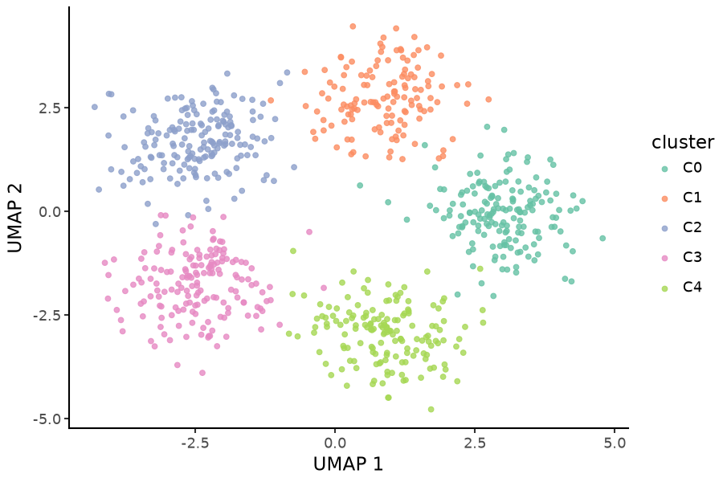
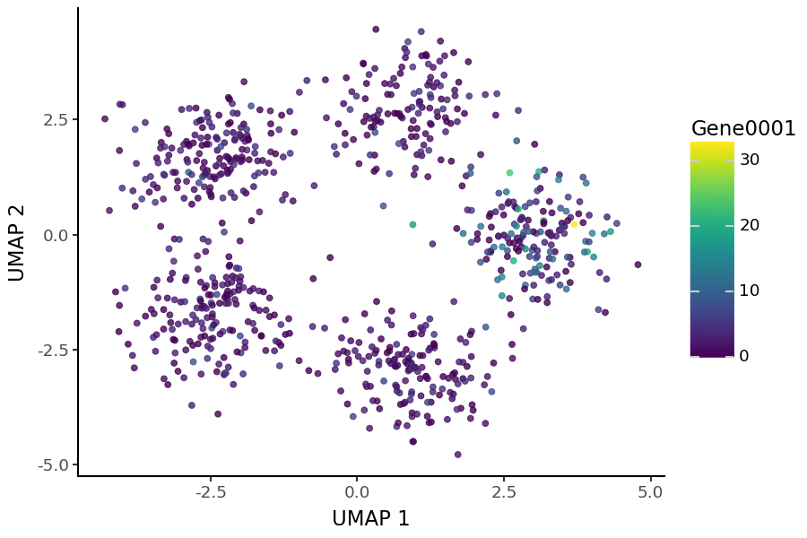
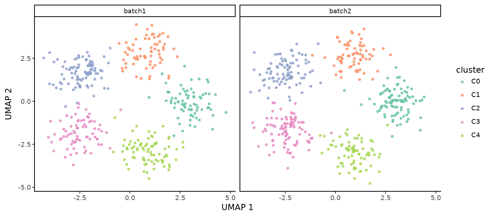
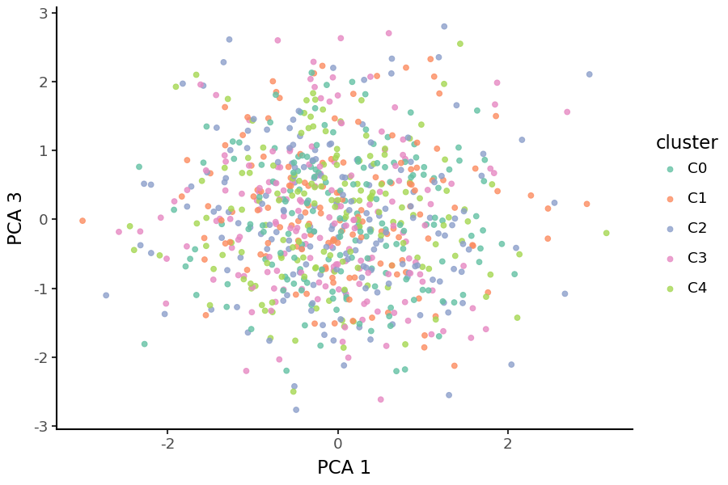

---

### General scatter

`plot_scatter` — the underlying workhorse that `plot_umap` / `plot_pca` delegate to.
`x` and `y` are resolved in priority order: obs column → gene name → DataFrame column.

```python
# QC scatter
plot_scatter(adata, x="n_counts", y="n_genes", color="cluster")

# Two genes
plot_scatter(adata, x="CD3E", y="CD8A", color="cluster")
```

**Call hierarchy:** `plot_umap` → `plot_reduced_dim` → `plot_scatter` → internal builder.

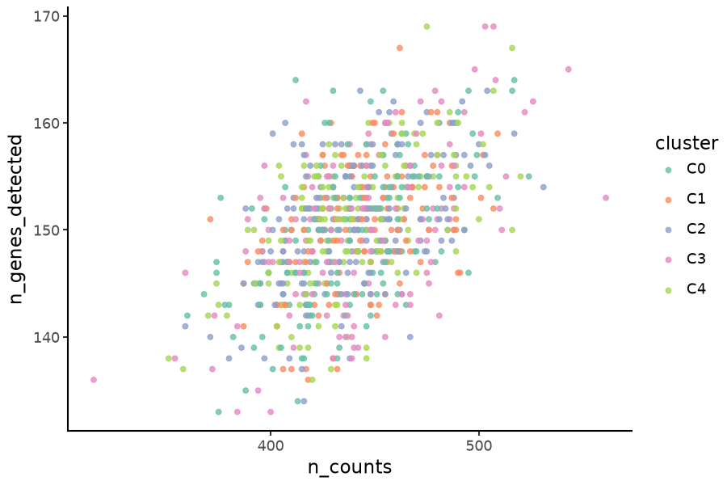
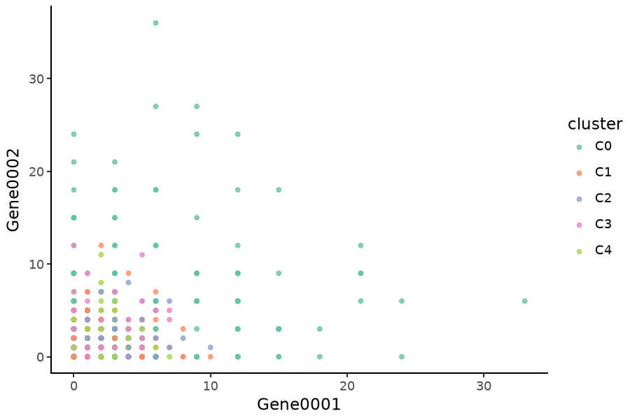

---

### Multi-panel embedding

`plot_embedding_panel` tiles one embedding panel per feature in a grid.  Returns a
`Compose` object (plotnine ≥ 0.15).  With `shared_scale=True`, all continuous
panels share the same color range.

```python
plot_embedding_panel(
    adata,
    features=["CD3E", "CD8A", "MS4A1", "GNLY"],
    ncol=2,
)
```

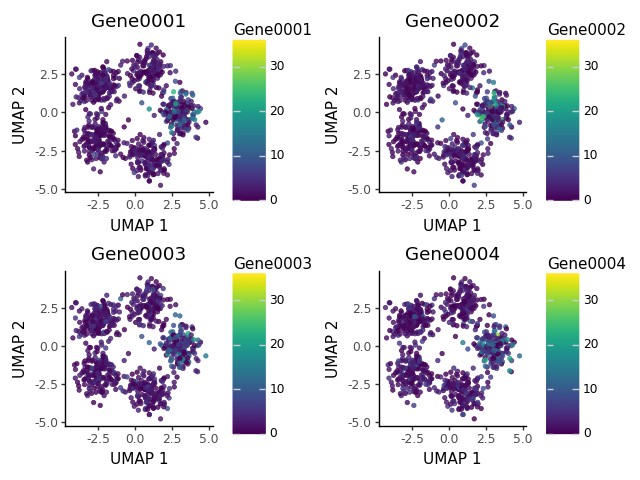

---

### Statistical plots

`plot_violin_stats` and `plot_box_stats` add automatic significance bars.

| Test | `test=` value |
|---|---|
| Mann–Whitney U | `"mannwhitney"` (default) |
| Wilcoxon signed-rank | `"wilcoxon"` |
| Welch's t-test | `"ttest"` |
| Kruskal–Wallis | `"kruskal"` |

| Annotation | `annotation=` value |
|---|---|
| Stars (\* / \*\* / \*\*\*) | `"stars"` (default) |
| Raw p-value | `"pvalue"` |
| Adjusted p-value | `"padj"` |

```python
plot_violin_stats(adata, "CD3E", group_by="cluster", annotation="stars")

plot_box_stats(adata, "n_counts", group_by="batch")
```

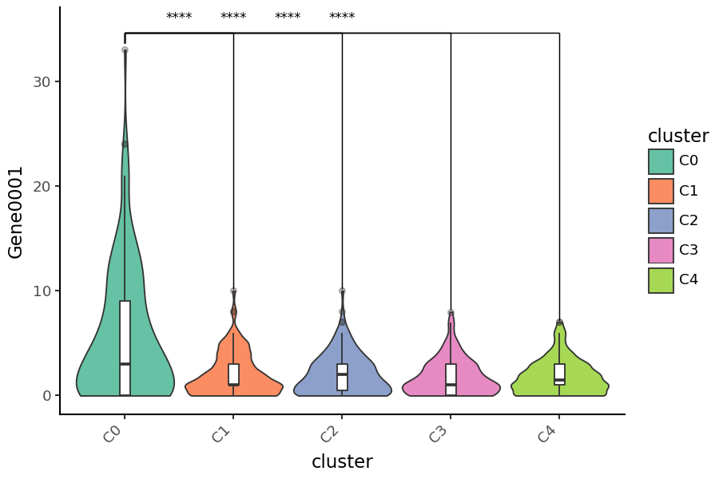
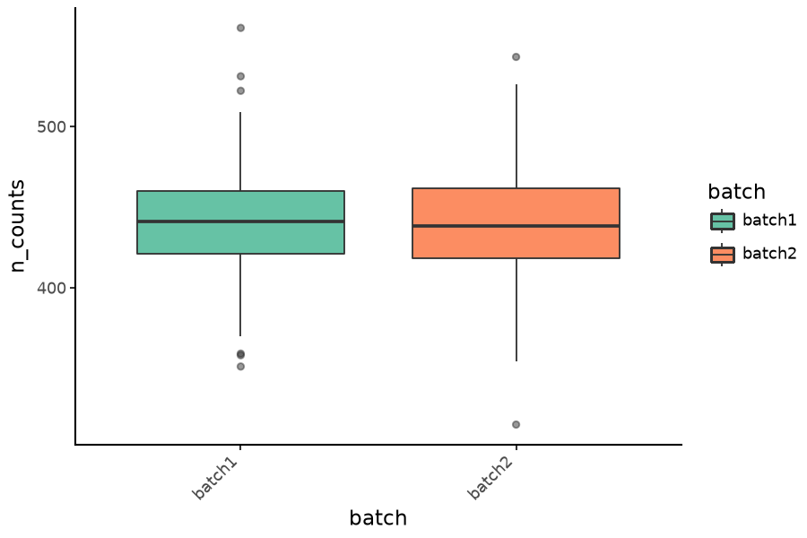

---

### Scatter with marginals

`plot_scatter_marginal` returns a `Compose` of three panels (top density,
central scatter, right density).  Width/height ratios are set automatically
on plotnine ≥ 0.16.

```python
plot_scatter_marginal(adata, x="n_counts", y="n_genes", color="cluster")
```

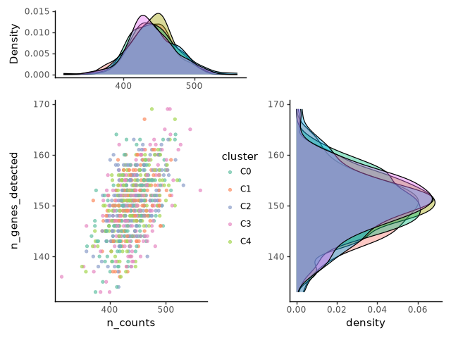

---

### Differential expression

`plot_volcano` and `plot_ma` work with any DESeq2-style DataFrame.
Top-*n* significant genes are labeled automatically.

| Column | Default name |
|---|---|
| Log fold change | `"log2FoldChange"` |
| Adjusted p-value | `"padj"` |
| Gene name | `gene_col=None` (uses index) |
| Mean expression | `"baseMean"` (MA only) |

Compatible with DESeq2, edgeR, and `scanpy.tl.rank_genes_groups` output after
converting to a DataFrame.

```python
plot_volcano(de_df, label_top_n=8)

plot_ma(de_df)
```

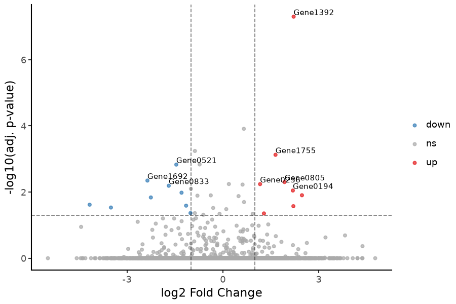
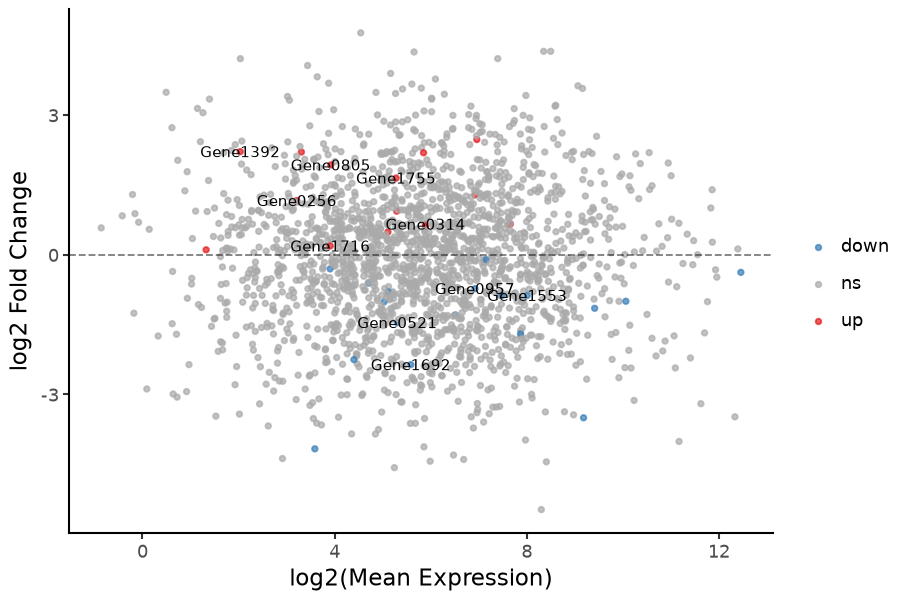

---

### Elastic net / LASSO results

`plot_coef_lollipop` shows top-*n* features by absolute coefficient value.
`plot_coef_expression` plots their expression using a dot plot, violin, or heatmap.

```python
lollipop = plot_coef_lollipop(coefs, top_n=15)
expr     = plot_coef_expression(adata, coefs, group_by="cluster", plot_type="dot")

# Compose side by side
lollipop | expr
```

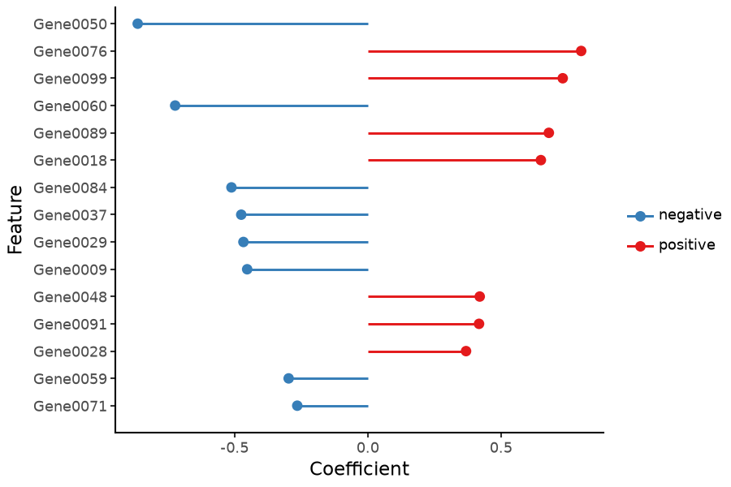
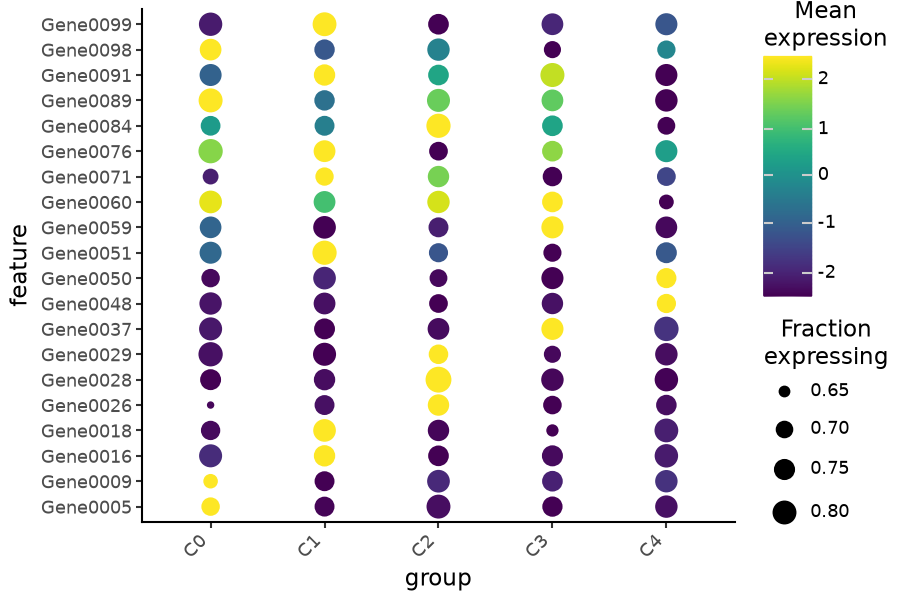

---

### Heatmaps

| Function | Input | Aggregation | Clustering | Notes |
|---|---|---|---|---|
| `heatmap_from_matrix` | `np.ndarray` / `pd.DataFrame` | — | optional | matrix-in API |
| `plot_heatmap` | any + feature list | none or per-group mean | rows / cols | main API |

`plot_heatmap` with `group_by` aggregates expression per group before rendering
(fast even for millions of cells).  `cluster_rows=True` / `cluster_cols=True`
run hierarchical clustering (requires scipy).

```python
from ggnomics.heatmap import heatmap_from_matrix

# From a raw numpy matrix
heatmap_from_matrix(matrix, zscore_rows=True)

# Grouped mean across clusters
plot_heatmap(adata, features=top_genes, group_by="cluster", cluster_rows=True)

# Fully clustered rows and columns
plot_heatmap(adata, features=top_genes, group_by="cluster",
             cluster_rows=True, cluster_cols=True)
```

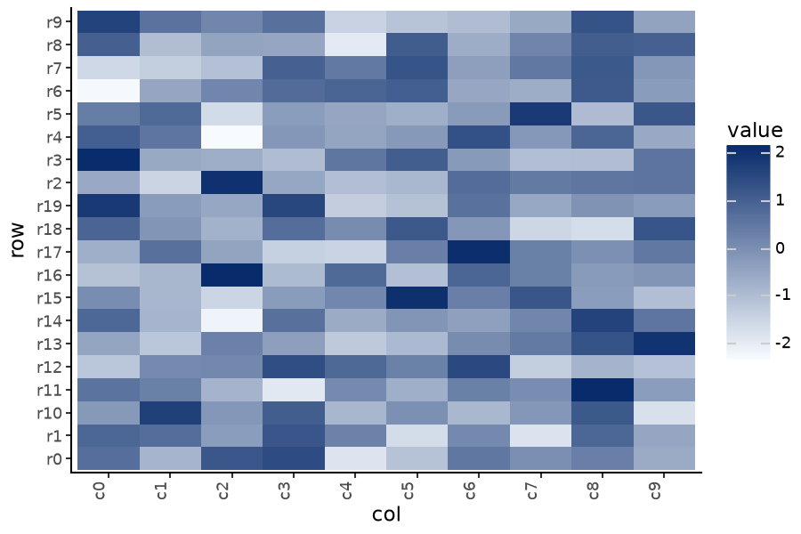
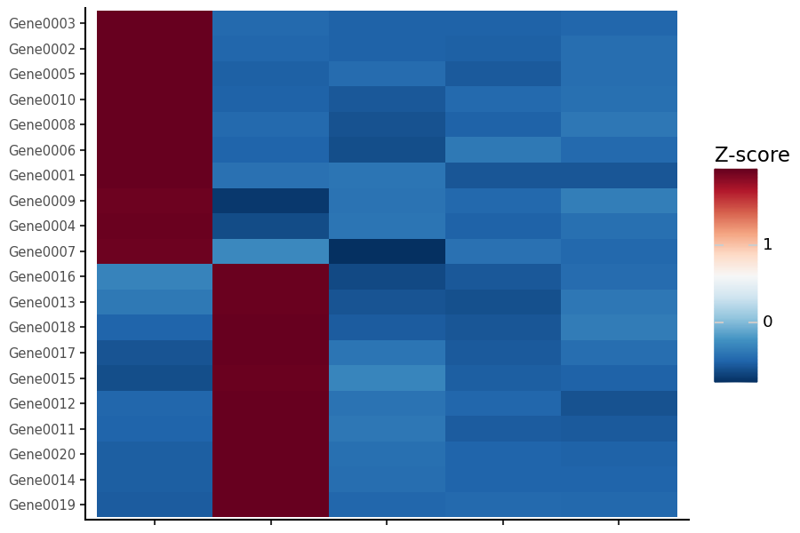
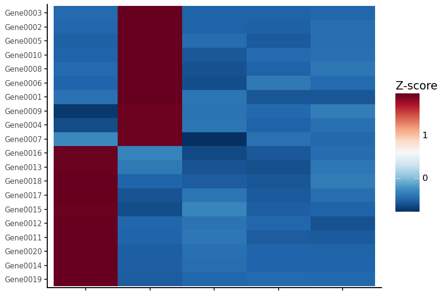

---

### Expression plots

`plot_expression` — violin plot per feature, faceted.  
`plot_dot` — classic dot plot (mean expression × fraction expressing).  
`plot_highest_exprs` — top-*n* most abundant genes ranked by median library-normalised expression.

```python
plot_expression(adata, features=["CD3E", "CD8A", "MS4A1"], group_by="cluster")

plot_dot(adata, features=top_genes, group_by="cluster")

plot_highest_exprs(adata, n=20)
```

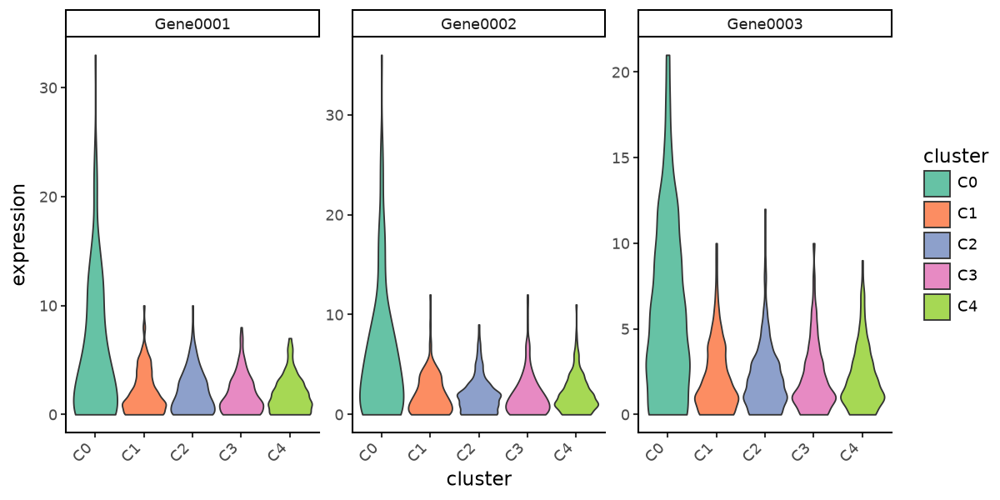
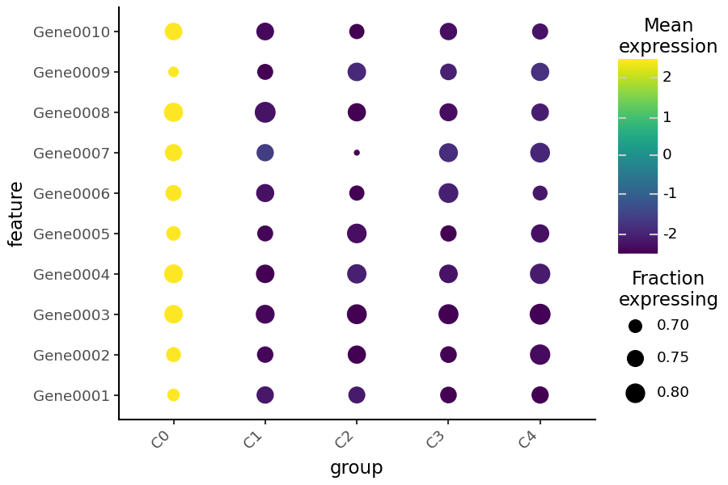
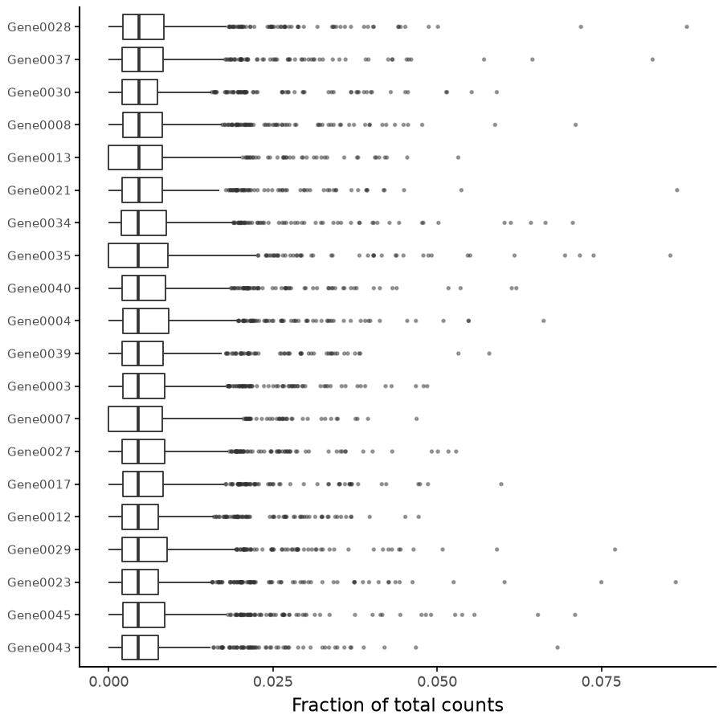

---

### Metadata plots

`plot_coldata` selects geometry automatically:

| `x` type | `shape=` | Geometry |
|---|---|---|
| numeric | (any) | scatter |
| categorical | `"violin"` | violin |
| categorical | `"box"` | box |
| categorical | `"bar"` | bar (mean y) |
| categorical | `"point"` | jittered strip |

`plot_abundance` — stacked bar chart of cell-type composition per group.

```python
plot_coldata(adata, x="n_counts", y="n_genes", color_by="cluster")

plot_coldata(adata, x="cluster", y="n_counts", shape="violin")

plot_abundance(adata, group_by="cluster", color_by="batch")
```

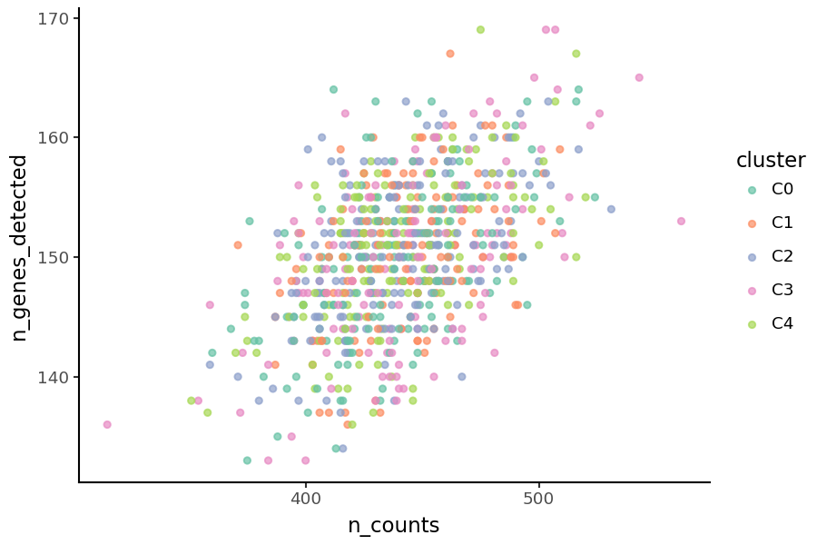
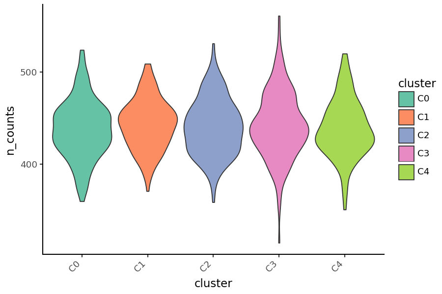
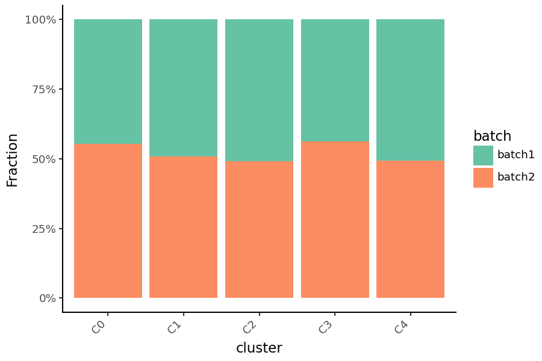

---

### Pseudobulk

`plot_pseudobulk_qc` returns a three-panel `Compose`: cells-per-sample-group barplot,
library-size violin, and pseudobulk PCA.

`plot_pseudobulk_de` supports three modes:

| `mode=` | Returns |
|---|---|
| `"volcano"` | grid of per-cluster volcanos (`Compose`) |
| `"summary_bar"` | up/down bar chart (`ggplot`) |
| `"upset"` | UpSet plot of shared significant genes (requires `upsetplot`) |

```python
plot_pseudobulk_qc(adata, sample_by="sample", group_by="cluster", condition_by="batch")

plot_pseudobulk_de(results_dict, mode="volcano", ncol=3)

plot_pseudobulk_de(results_dict, mode="summary_bar")
```

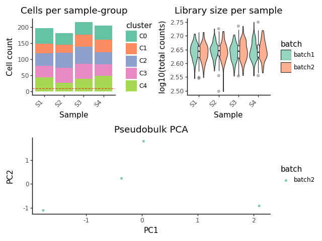
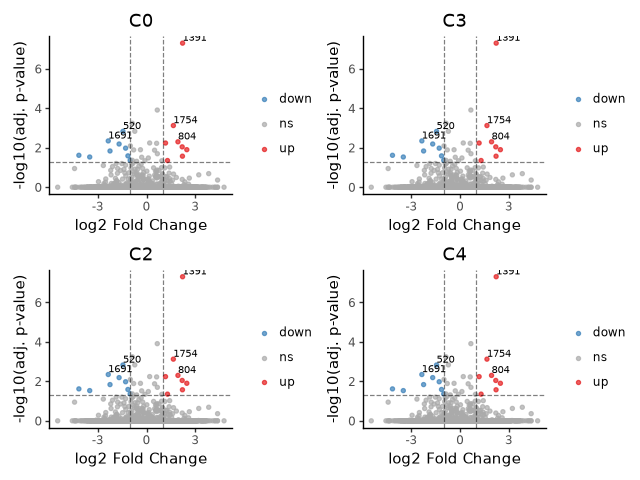
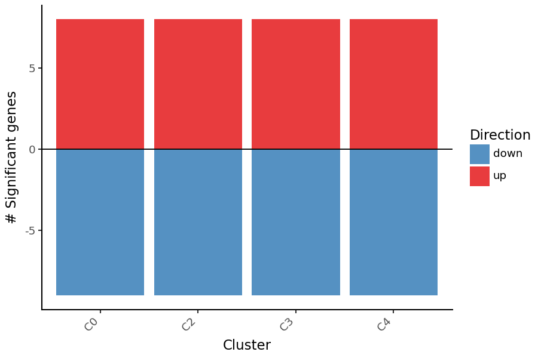

---

### CITEseq / Multimodal

`plot_bimodal_scatter` — RNA vs protein scatter.  Accepts `MuData` (separate modalities)
or `AnnData` with multiple layers.

`plot_adt_qc` — density curves of all real antibodies, with pooled isotype control
as a grey fill.

```python
# MuData: resolve features from separate modalities
plot_bimodal_scatter(mdata, x_feature="CD3E", y_feature="CD3-TotalSeqB",
                     x_mod="rna", y_mod="prot")

# ADT QC
plot_adt_qc(adata_prot, isotype_controls=["IgG1", "IgG2"])
```

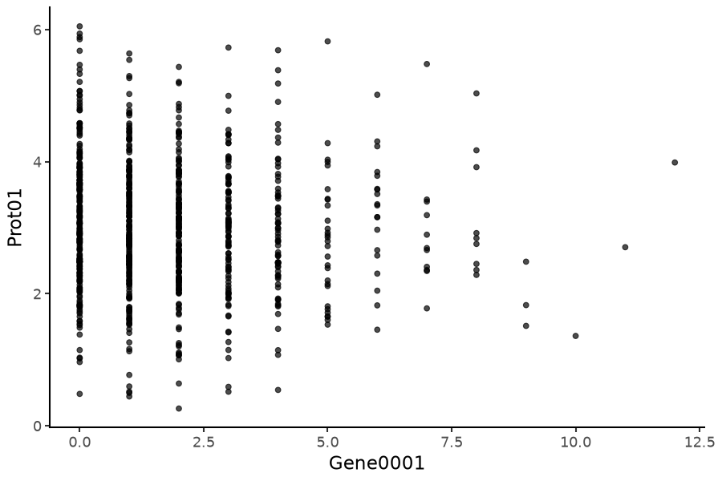
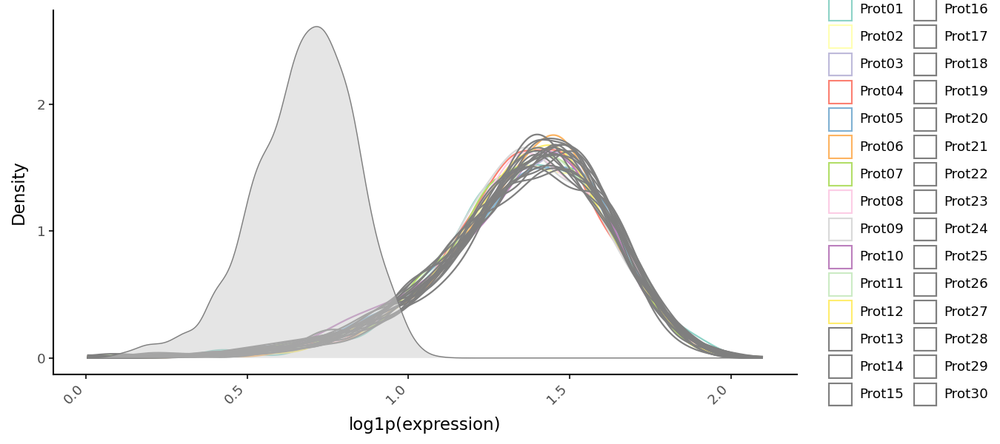

---

### Repertoire (TCR/BCR)

`plot_clonotype_abundance` — barplot of top-*n* clonotypes colored by expansion category
(Single / Small / Medium / Large / Hyperexpanded, matching scRepertoire defaults).

`plot_clonotype_overlap` — pairwise sample overlap heatmap (Jaccard, Morisita, or
overlap coefficient). Returns a `HeatmapResult` with `.matrix` and `.savefig()`.

`plot_clonotype_embedding` — UMAP colored by expansion category.

```python
plot_clonotype_abundance(adata, clonotype_col="clonotype_id")

result = plot_clonotype_overlap(adata, clonotype_col="clonotype_id", sample_col="sample")
print(result.matrix)       # square DataFrame of overlap scores
result.savefig("fig.png")

plot_clonotype_embedding(adata, clonotype_col="clonotype_id")
```

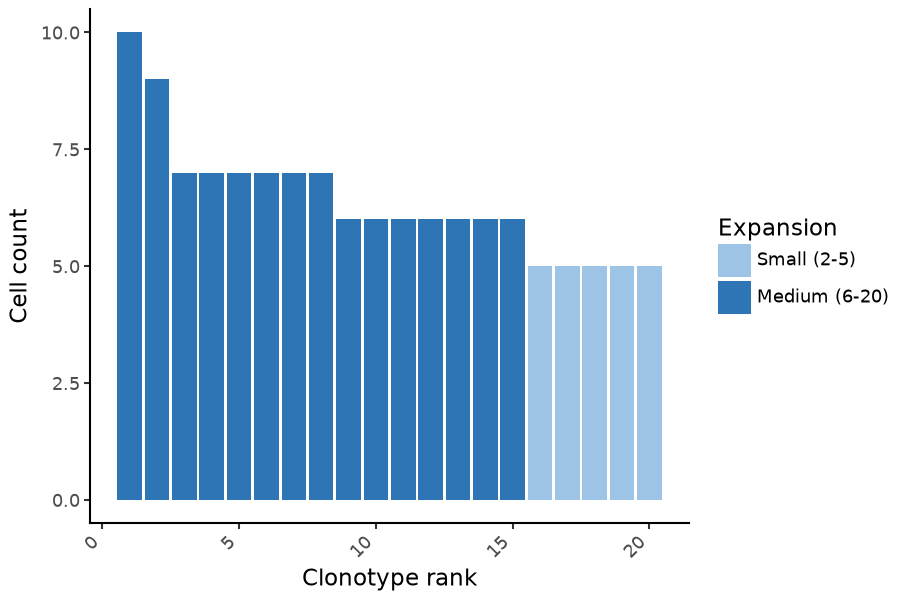
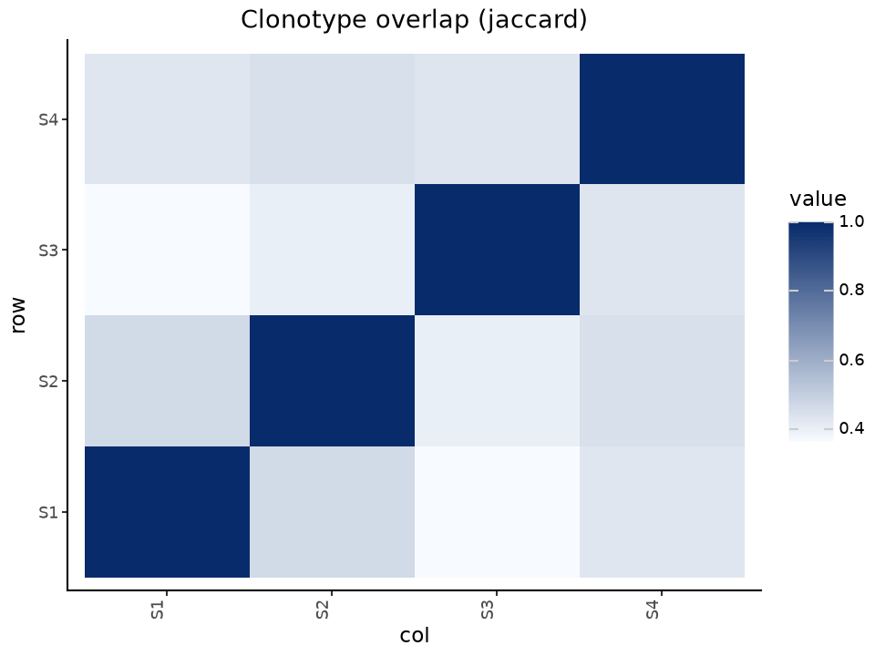
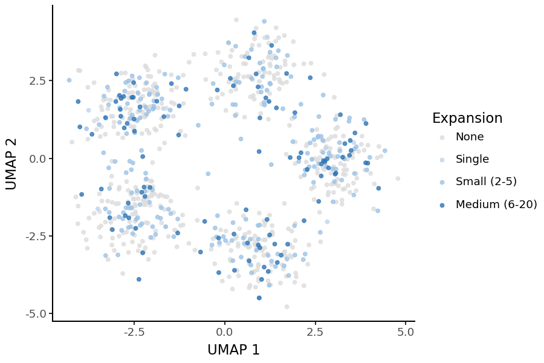

---

## Plot composition

Every ggnomics function returns a `ggplot` or a plotnine `Compose`.
All standard plotnine composition operators work without extra dependencies.

```python
from plotnine.composition import plot_spacer

umap    = plot_umap(adata, color="cluster")
violin  = plot_violin_stats(adata, "CD3E", group_by="cluster")
volcano = plot_volcano(de_df)

# Side by side
umap | violin

# Stack vertically
(umap | violin) / volcano

# Apply a theme to every panel
(umap | violin) & theme_minimal()

# Save
(umap | violin).save("figure.png", dpi=150)
```

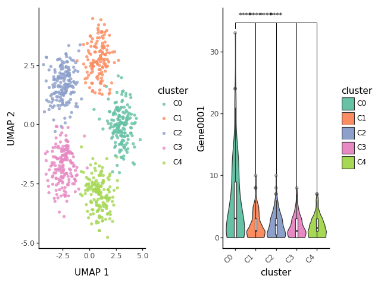

### `plot_layout` (plotnine ≥ 0.16)

```python
from plotnine.composition import plot_layout, plot_annotation

(umap + violin + volcano + dot) + plot_layout(ncol=2, widths=[2, 1])
(umap | violin) + plot_annotation(title="Figure 1")
```

ggnomics ships thin wrappers `hstack`, `vstack`, `grid`, `annotate_composition`,
and `save_composition` that dispatch to the right API for both plotnine 0.15 and 0.16.

---

## All functions — reference table

### Current API

| Function | Module | Returns | Description |
|---|---|---|---|
| `plot_scatter` | `ggnomics.scatter` | `ggplot` | General scatter for any two obs/gene/embedding variables |
| `plot_reduced_dim` | `ggnomics.scatter` | `ggplot` | 2-D embedding plot (any `obsm` key) |
| `plot_umap` | `ggnomics.scatter` | `ggplot` | `plot_reduced_dim` preset for `X_umap` |
| `plot_pca` | `ggnomics.scatter` | `ggplot` | `plot_reduced_dim` preset for `X_pca` |
| `plot_tsne` | `ggnomics.scatter` | `ggplot` | `plot_reduced_dim` preset for `X_tsne` |
| `plot_embedding_panel` | `ggnomics.stats_plots` | `Compose` | Grid of embedding panels, one per feature |
| `plot_scatter_marginal` | `ggnomics.stats_plots` | `Compose` | Scatter with top/right marginal densities |
| `plot_violin_stats` | `ggnomics.stats_plots` | `ggplot` | Violin with pairwise significance bars |
| `plot_box_stats` | `ggnomics.stats_plots` | `ggplot` | Box plot with pairwise significance bars |
| `plot_expression` | `ggnomics.expression` | `ggplot` | Faceted violin of feature expression per group |
| `plot_dot` | `ggnomics.expression` | `ggplot` | Dot plot (mean expression × fraction expressing) |
| `plot_heatmap` | `ggnomics.expression` | `ggplot` | Expression heatmap, optionally grouped and clustered |
| `plot_highest_exprs` | `ggnomics.highest_exprs` | `ggplot` | Top-*n* highest-expressed genes (library-normalised) |
| `plot_coldata` | `ggnomics.coldata` | `ggplot` | obs/colData scatter, violin, box, bar, or strip |
| `plot_rowdata` | `ggnomics.coldata` | `ggplot` | var/rowData scatter |
| `plot_abundance` | `ggnomics.abundance` | `ggplot` | Stacked bar of cluster composition per group |
| `plot_pairs` | `ggnomics.pairs` | `ggplot` | Scatterplot matrix of embedding components |
| `plot_volcano` | `ggnomics.de_plots` | `ggplot` | Volcano plot from a DE results DataFrame |
| `plot_ma` | `ggnomics.de_plots` | `ggplot` | MA plot (mean expression vs log fold change) |
| `plot_coef_lollipop` | `ggnomics.de_plots` | `ggplot` | Lollipop plot of elastic net / LASSO coefficients |
| `plot_coef_expression` | `ggnomics.de_plots` | `ggplot` | Expression of top coefficient features (dot/violin/heatmap) |
| `plot_pseudobulk_qc` | `ggnomics.pseudobulk` | `Compose` | Three-panel pseudobulk QC figure |
| `plot_pseudobulk_de` | `ggnomics.pseudobulk` | `Compose\|ggplot` | DE results across clusters (volcano grid / summary bar / UpSet) |
| `plot_bimodal_scatter` | `ggnomics.multimodal` | `ggplot\|Compose` | RNA vs protein scatter (MuData or AnnData layers) |
| `plot_adt_qc` | `ggnomics.multimodal` | `ggplot` | ADT density curves with isotype control overlay |
| `plot_clonotype_abundance` | `ggnomics.repertoire` | `ggplot` | Clonotype abundance barplot colored by expansion |
| `plot_clonotype_overlap` | `ggnomics.repertoire` | `HeatmapResult` | Pairwise sample overlap heatmap |
| `plot_clonotype_embedding` | `ggnomics.repertoire` | `ggplot` | Embedding colored by clonotype expansion category |
| `get_palette` | `ggnomics.palettes` | `dict` | Named color palette (tableau10/20, bioc) |
| `hstack` | `ggnomics._compose` | `Compose` | Place plots side by side |
| `vstack` | `ggnomics._compose` | `Compose` | Stack plots vertically |
| `grid` | `ggnomics._compose` | `Compose` | Arrange plots in a grid |
| `annotate_composition` | `ggnomics._compose` | `Compose` | Add title/subtitle/caption to a composition |
| `save_composition` | `ggnomics._compose` | `None` | Save a composition to a file |

### Legacy API (backwards-compatible)

| Function | Replaces |
|---|---|
| `expression_violin` | `plot_expression` |
| `expression_violin_sce` | `plot_expression` on SCE |
| `expression_violin_se` | `plot_expression` on SE |
| `volcano_plot` | `plot_volcano` |
| `heatmap_long` | `plot_heatmap` |
| `heatmap_from_matrix` | `plot_heatmap` on a matrix |
| `marker_dotplot` | `plot_dot` |
| `marker_dotplot_from_matrix` | `plot_dot` on a matrix |
| `qc_scatter` | `plot_coldata` |
| `qc_histogram` | `plot_coldata` |
| `cluster_composition_barplot` | `plot_abundance` |
| `ridge_density` | standalone ridge plot |

---

## Contributing

See `examples/` for worked notebooks on each plot type.  Adding a new plot requires:

1. Implementation in `ggnomics/<module>.py`
2. Export in `ggnomics/__init__.py`
3. Tests in `tests/test_<module>.py`
4. A notebook in `examples/`
5. A row in the reference table above

Mock data helpers for tests and examples live in `examples/00_mock_data.py`.

---

## License

MIT
