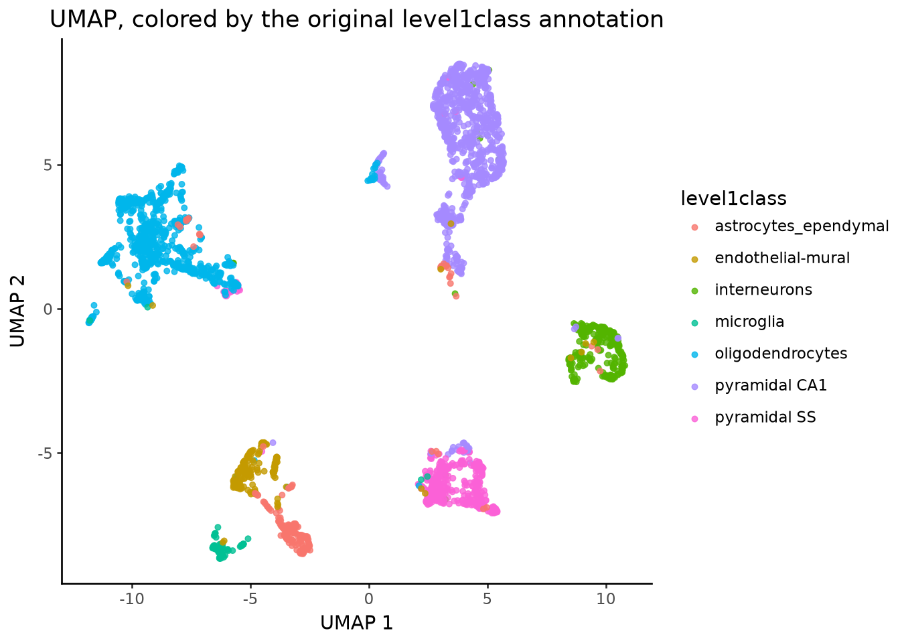
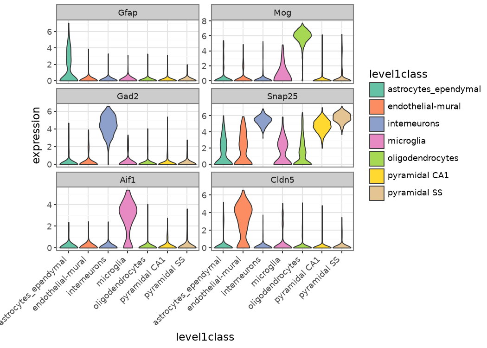
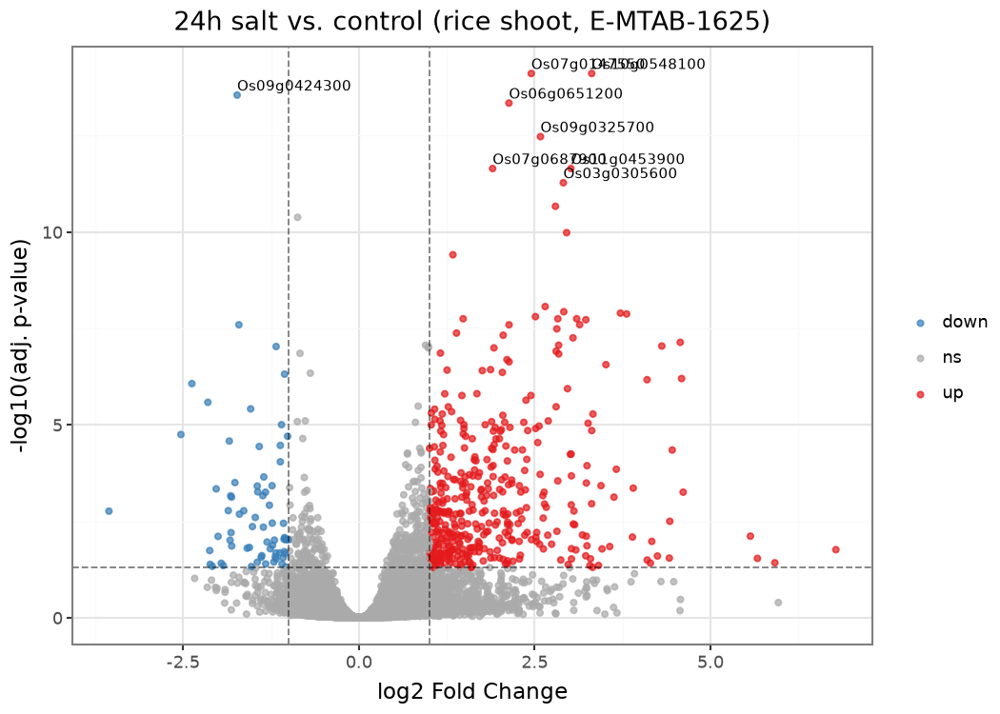
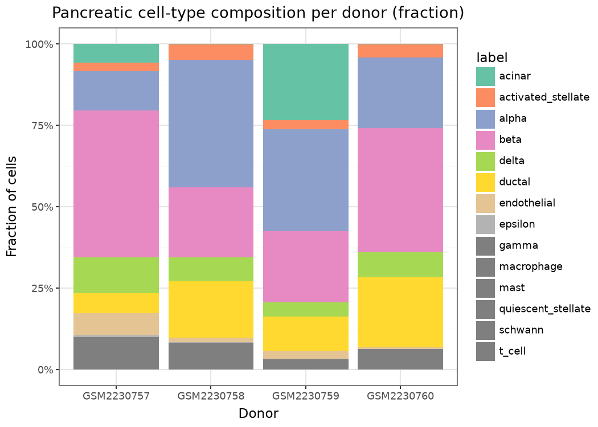
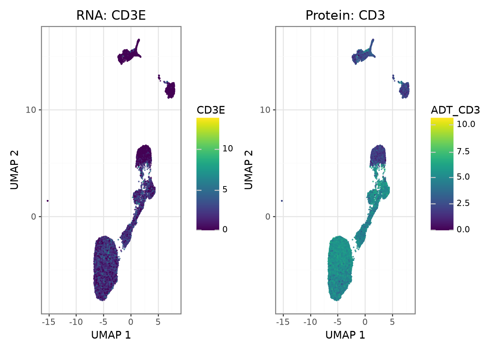
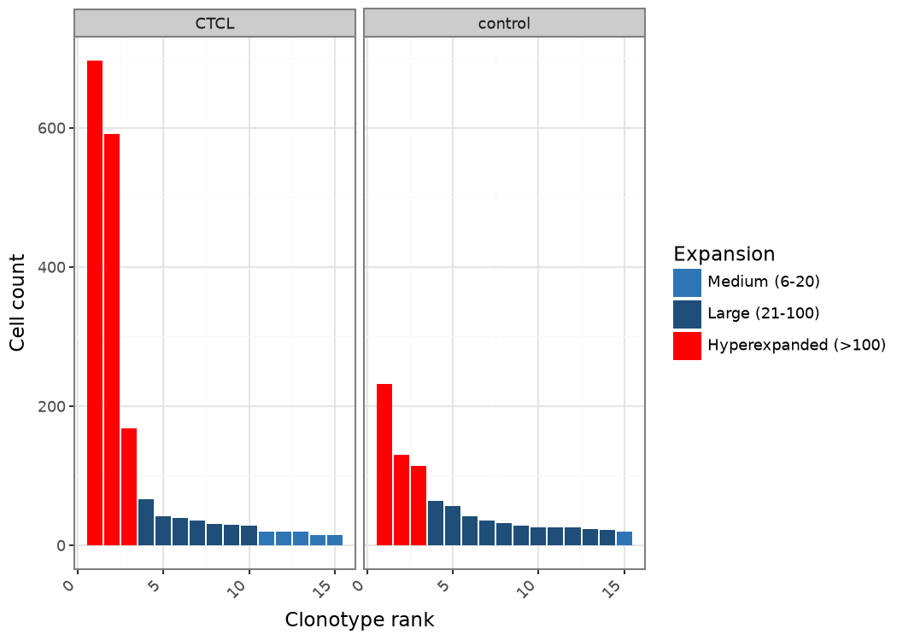
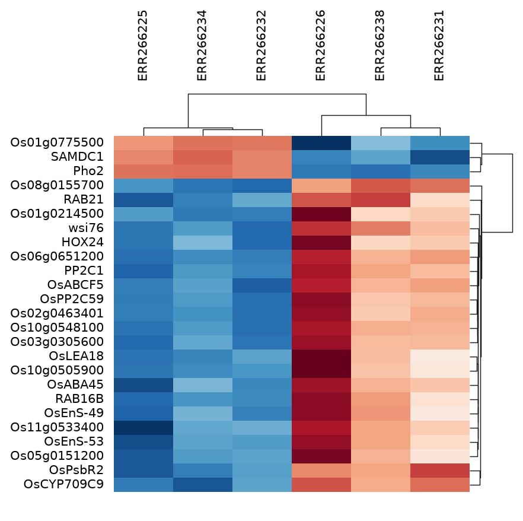
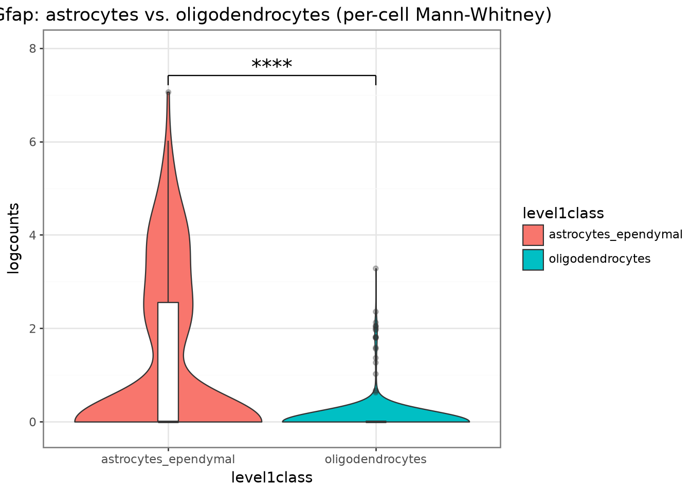

# ggnomics

**Composable genomics visualization with plotnine.**

`ggnomics` provides plotting functions for bulk, single-cell, and multimodal
genomics in Python. It covers familiar visualizations from tools such as
scater, Seurat, and scanpy while returning ordinary
[`plotnine`](https://plotnine.org) objects that can be extended with the
grammar of graphics.

The package works with tidy `pandas` data and common genomics containers,
including AnnData, BiocPy `SingleCellExperiment`, `SummarizedExperiment`, and
MuData.

**[Documentation](https://maximiliannuber.github.io/ggnomics/)** ·
**[Getting started](https://maximiliannuber.github.io/ggnomics/tutorials/getting-started.html)** ·
**[Plot gallery](https://maximiliannuber.github.io/ggnomics/tutorials/plot-gallery.html)** ·
**[API reference](https://maximiliannuber.github.io/ggnomics/api/ggnomics.html)**

## Installation

```bash
pip install ggnomics
```

The core installation supports DataFrame-based plotting. Optional extras add
support for genomics containers and analysis-specific functionality:

```bash
pip install "ggnomics[anndata]"  # AnnData
pip install "ggnomics[sce]"      # SingleCellExperiment
pip install "ggnomics[se]"       # SummarizedExperiment
pip install "ggnomics[all]"      # all optional features
```

## Quick start

Plot a stored UMAP from an AnnData object:

```python
import ggnomics as gg

p = gg.plot_umap(adata, color="cell_type")
p
```

The result is a `plotnine.ggplot`, so it can be changed with ordinary
plotnine layers:

```python
from plotnine import labs, scale_color_brewer, theme_classic

(
    p
    + theme_classic()
    + scale_color_brewer(type="qual", palette="Set2")
    + labs(title="Cell populations", color="Cell type")
)
```

The same plotting functions can be called on supported BiocPy objects. For
example, the Zeisel mouse brain dataset can be loaded as a
`SingleCellExperiment` and plotted directly:

```python
import scrnaseq
import ggnomics as gg

sce = scrnaseq.fetch_dataset(
    "zeisel-brain-2015",
    "2023-12-14",
    realize_assays=True,
)

gg.plot_expression(
    sce,
    features=["Gfap"],
    group_by="level1class",
    layer="counts",
    log1p=True,
)
```

See [Getting started](https://maximiliannuber.github.io/ggnomics/tutorials/getting-started.html)
for equivalent examples with DataFrame, SingleCellExperiment, and AnnData.

## Plot families

`ggnomics` includes functions for:

- PCA, UMAP, t-SNE, and other reduced dimensions
- gene-expression violins, dot plots, ridge plots, and heatmaps
- cell and sample metadata
- abundance and composition
- single-cell and pseudobulk quality control
- volcano, MA, and coefficient plots
- native Plotnine UpSet plots and Venn diagrams for set intersections
- multimodal RNA + protein visualization and ADT quality control
- clonotype abundance, overlap, and repertoire embeddings
- statistical annotations and ggsignif-style brackets
- multi-panel plot composition

The [plot gallery](https://maximiliannuber.github.io/ggnomics/tutorials/plot-gallery.html)
groups the available functions by analysis task and includes runnable examples.

Native UpSet plotting (`ggnomics.upset`) is available with the normal package
install, no optional dependency is needed for plotting itself:

```python
import ggnomics.upset as upset

upset.upset(data, ["set_a", "set_b", "set_c"])
```

It returns an ordinary `plotnine.composition.Compose`. Only the
between-intersection statistical comparison helpers
(`upset.compare_between_intersections`, `upset.upset_test`) require
`pip install "ggnomics[upset]"` (scipy and statsmodels).

## Input containers

| Container | Package | Typical use |
|---|---|---|
| `pandas.DataFrame` | pandas | Tidy plotting tables and model results |
| `AnnData` | anndata / scverse | Single-cell assays, metadata, and embeddings |
| `SingleCellExperiment` | BiocPy | Single-cell assays, metadata, and reduced dimensions |
| `SummarizedExperiment` | BiocPy | Bulk assays and sample metadata |
| `MuData` | mudata / scverse | Measurements across several modalities |

The public plotting functions use Python's `singledispatch`, so the function
name and principal arguments remain the same across supported containers.
Container-specific implementations are registered automatically when their
optional dependencies are installed.

A plain `SummarizedExperiment` does not store reduced dimensions. It can be
used for assay- and metadata-based plots, while embedding plots require
explicit coordinates or a container such as `SingleCellExperiment` or
AnnData. `ggnomics.bulk_pca` provides PCA directly from a bulk assay.

## Examples

| | |
|---|---|
| <br>`plot_umap` on the Zeisel mouse brain dataset.<br>[Single-cell workflow](https://maximiliannuber.github.io/ggnomics/tutorials/single-cell-scranpy.html) | <br>`plot_expression` for marker genes across cell classes.<br>[Single-cell workflow](https://maximiliannuber.github.io/ggnomics/tutorials/single-cell-scranpy.html) |
| <br>`plot_volcano` for the 24-hour salt-stress comparison in E-MTAB-1625.<br>[Bulk RNA-seq workflow](https://maximiliannuber.github.io/ggnomics/tutorials/bulk-rnaseq.html) | <br>`plot_abundance` for pancreatic cell-type composition across donors.<br>[Specialized plots](https://maximiliannuber.github.io/ggnomics/tutorials/specialized-plots.html) |
| <br>RNA and ADT abundance on a shared CITE-seq embedding.<br>[Multimodal workflow](https://maximiliannuber.github.io/ggnomics/tutorials/multimodal.html) | <br>`plot_clonotype_abundance` for ECCITE-seq TCR data.<br>[Specialized plots](https://maximiliannuber.github.io/ggnomics/tutorials/specialized-plots.html) |
| <br>PyDESeq2 results displayed with a Marsilea heatmap.<br>[Specialized plots](https://maximiliannuber.github.io/ggnomics/tutorials/specialized-plots.html) | <br>`plot_violin_stats` and `geom_signif` for statistical annotations.<br>[Specialized plots](https://maximiliannuber.github.io/ggnomics/tutorials/specialized-plots.html) |

## Workflow guides

- [Getting started](https://maximiliannuber.github.io/ggnomics/tutorials/getting-started.html)
- [Single-cell analysis with scranpy](https://maximiliannuber.github.io/ggnomics/tutorials/single-cell-scranpy.html)
- [Bulk RNA-seq with PyDESeq2](https://maximiliannuber.github.io/ggnomics/tutorials/bulk-rnaseq.html)
- [Native UpSet plots](https://maximiliannuber.github.io/ggnomics/tutorials/upset.html)
- [Multimodal RNA and protein](https://maximiliannuber.github.io/ggnomics/tutorials/multimodal.html)
- [Specialized plots](https://maximiliannuber.github.io/ggnomics/tutorials/specialized-plots.html)
- [Plot gallery](https://maximiliannuber.github.io/ggnomics/tutorials/plot-gallery.html)
- [API reference](https://maximiliannuber.github.io/ggnomics/api/ggnomics.html)

The workflows use ggnomics alongside BiocPy, scverse, scranpy, PyDESeq2, and
Marsilea. These packages perform data access or analysis; ggnomics provides
the visualization layer.

## Optional dependencies

```bash
pip install "ggnomics[anndata]"    # AnnData / scverse
pip install "ggnomics[sce]"        # SingleCellExperiment
pip install "ggnomics[se]"         # SummarizedExperiment
pip install "ggnomics[multimodal]" # MuData
pip install "ggnomics[stats]"      # statistical tests and significance brackets
pip install "ggnomics[pca]"        # PCA utilities
pip install "ggnomics[pseudobulk]" # pseudobulk QC PCA panel
pip install "ggnomics[upset]"      # ggnomics.upset statistical comparisons (scipy, statsmodels)
pip install "ggnomics[umap]"       # UMAP utilities
pip install "ggnomics[all]"        # all optional features
```

## Documentation

The documentation is a Sphinx site in the BiocPy house style, with the workflow
guides included as executed Jupyter notebooks:

| | |
|---|---|
| [Tutorials](https://maximiliannuber.github.io/ggnomics/tutorials/index.html) | Workflow guides against real public datasets |
| [API reference](https://maximiliannuber.github.io/ggnomics/api/ggnomics.html) | Every public function, generated from the docstrings |
| [Contributing](https://github.com/MaximilianNuber/ggnomics/blob/main/CONTRIBUTING.md) | Development setup, tests, and how the docs are built |

The tutorials are authored as Quarto vignettes under `vignettes/`, which also
build a Quarto site of their own. See
[CONTRIBUTING.md](https://github.com/MaximilianNuber/ggnomics/blob/main/CONTRIBUTING.md)
for both build paths.

## Development status

`ggnomics` is under active development. A small legacy API including
`expression_violin`, `volcano_plot`, and `heatmap_from_matrix` is retained for
backwards compatibility. The [plot gallery](https://maximiliannuber.github.io/ggnomics/tutorials/plot-gallery.html)
identifies current and legacy interfaces.

## License

Licensed under the [MIT License](https://github.com/MaximilianNuber/ggnomics/blob/main/LICENSE).
